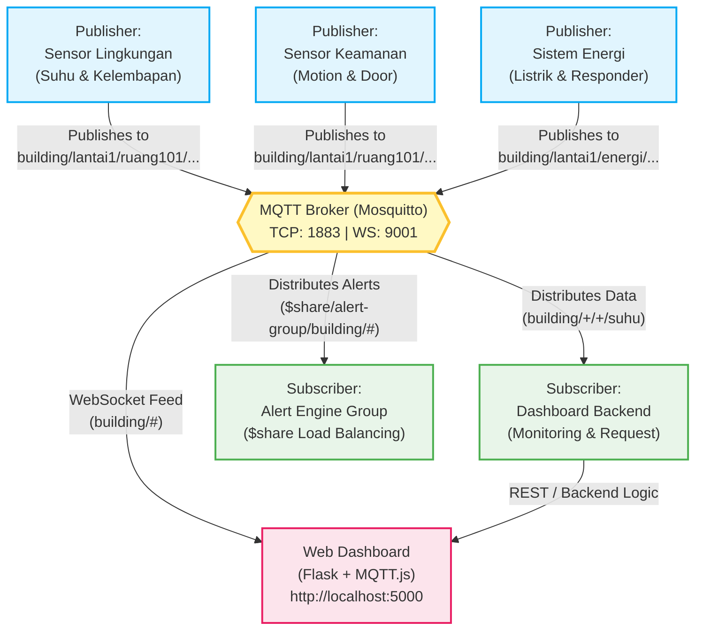
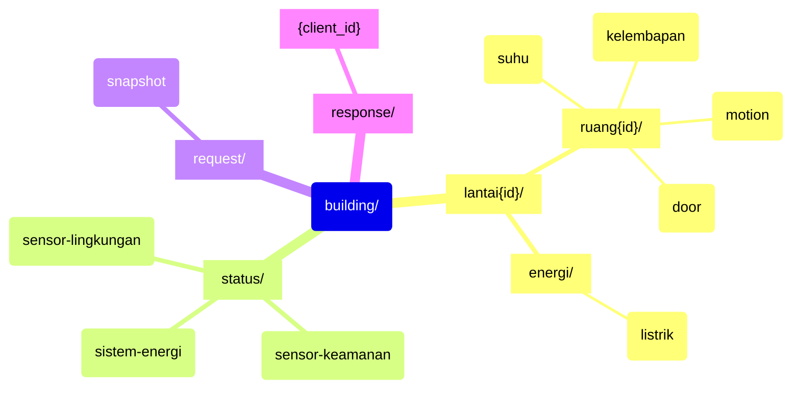
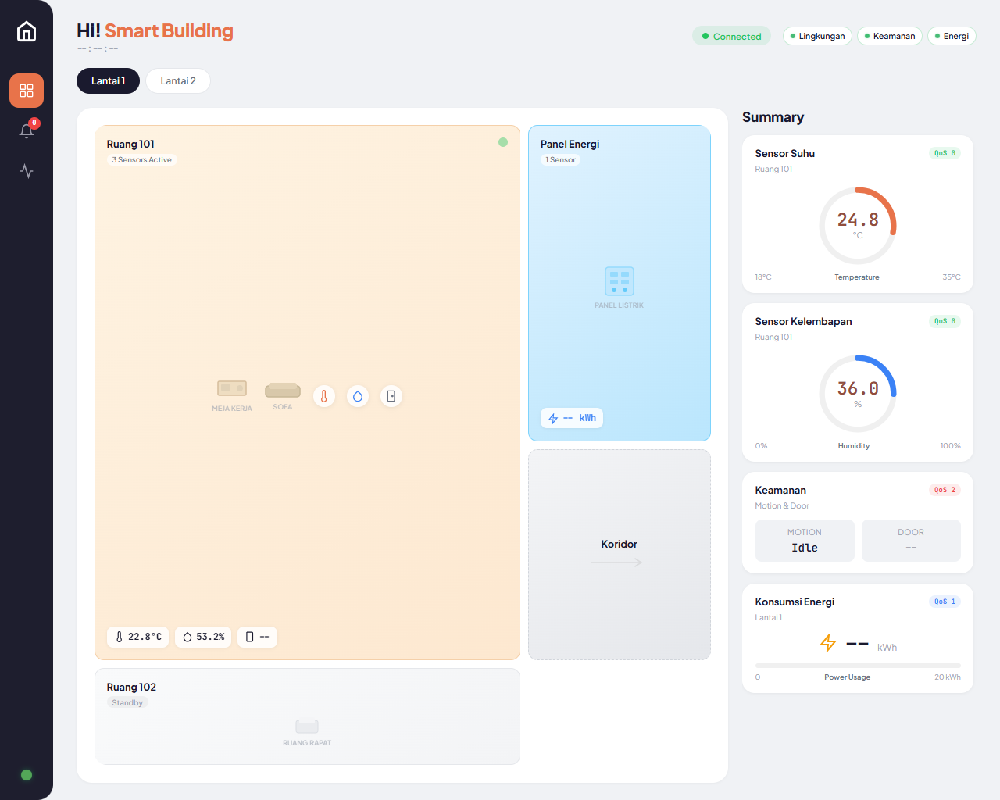

# Laporan Proyek: Smart Building Monitoring System — MQTT Protocol

**Anggota Kelompok:**
* Rayhan Agnan Kusuma — 5027241102

---

## 1. Deskripsi Singkat Projek
Sistem ini adalah simulasi **Smart Building Monitoring** berbasis IoT yang sepenuhnya memanfaatkan protokol **MQTT v5**. Sistem dirancang untuk mengumpulkan data dari berbagai macam sensor (suhu, kelembapan, keamanan pintu, deteksi gerak, dan konsumsi energi) di sebuah gedung.

Alih-alih menggunakan hardware fisik, simulasi ini menggunakan publisher berbasis Python yang terus menghasilkan dan mempublikasikan data secara dinamis ke **Mosquitto Broker**. Data tersebut di-subscribe secara real-time oleh sebuah *Web Dashboard* interaktif untuk keperluan *monitoring* dan *Alert Engine* terpusat untuk pemrosesan notifikasi lanjutan. Proyek ini mendemonstrasikan implementasi ekstensif dari 10+ fitur MQTT tingkat lanjut secara terintegrasi.

---

## 2. Arsitektur (Diagram Sistem)

Sistem menggunakan arsitektur *Publish-Subscribe* terpusat dengan Mosquitto sebagai perantara (broker) komunikasi antara seluruh komponen IoT simulasi.

---

## 3. Design Topic (Topic Tree)

Desain topik disusun secara hierarkis (mengikuti pola `kategori/lantai/ruang/jenis`) sehingga memudahkan penulisan *subscription wildcard* untuk memantau perangkat yang spesifik maupun kolektif.

**Penjelasan Alokasi Quality of Service (QoS):**
- **QoS 0:** Data telemetry periodik (suhu, kelembapan) yang aman jika terlewat 1-2 kali (*fire-and-forget*).
- **QoS 1:** Data penting seperti konsumsi listrik atau deteksi motion (*at-least-once*).
- **QoS 2:** Perintah akses kendali pintu (*door lock/unlock*) yang tidak boleh ada redudansi ganda (*exactly-once*).

---

## 4. Fitur-Fitur Sistem

Sistem ini telah mengimplementasikan setidaknya 10 fitur dari protokol MQTT v5.

1. **Publish/Subscribe (Pub/Sub):** Pola komunikasi dasar di mana *Sensor Publisher* mengirim status sedangkan *Alert Engine* dan *Dashboard* menerimanya secara *decoupled*.
2. **Quality of Service (QoS 0, 1, 2):** Implementasi level garansi pengiriman menyesuaikan tingkat urgensi paket data.
3. **Wildcard `+` (Single-level):** Subscriber dashboard menggunakan `building/+/+/suhu` untuk memantau suhu di seluruh ruangan dan lantai sekaligus.
4. **Wildcard `#` (Multi-level):** Frontend web mengambil semua payload event dengan subscribe ke `building/#`
5. **Retained Messages:** Data periodik dikirim dengan *retain flag*. Jika dashboard di-refresh, nilai suhu dan kelembapan akan langsung muncul seketika karena *Broker* mengirim cache nilai terakhir.
6. **Last Will and Testament (LWT):** Apabila *publisher* terputus secara tidak wajar (misal: terminal dimatikan mendadak), broker secara otomatis mengirim status offline ke dashboard untuk memberikan peringatan visual merah ("Offline").
7. **Request-Response (MQTT v5):** Memungkinkan Web Dashboard meminta *(request)* snapshot rekapitulasi ke *Sistem Energi* dan menerima balasannya *(response)* di topik spesifik untuk masing-masing *client identifier*.
8. **Shared Subscription:** Digunakan pada sistem Alert Engine (`$share/alert-group/building/#`). Jika dijalankan 2 *instance Alert Engine* bersamaan, trafik *event* akan didistribusikan (*Load Balanced*) sehingga satu pesan tidak diolah 2 kali.
9. **Topic Alias (MQTT v5):** Penghematan *bandwidth* pada publisher suhu dengan memetakan topik string panjang ke alias integer (contoh: `Alias: 1`).
10. **Message Expiry (MQTT v5):** Pesan perintah *door unlock* akan diset memiliki interval kedaluwarsa 10 detik. Jika koneksi lambat dan baru diproses lebih dari 10 detik, broker akan membuang pesan tersebut demi keamanan.

---

## 5. Dashboard (Screenshot Tampilan & Penjelasan Fitur UI)

Berikut adalah antarmuka utama dari Web Dashboard yang terhubung via WebSocket secara *real-time*:

### Penjelasan Fitur Dashboard
*   **Connection & LWT Status (Kiri Atas):** Menunjukkan status koneksi *WebSocket* antara browser dengan Mosquitto. Indikator "Lingkungan", "Keamanan", dan "Energi" merupakan visualisasi LWT yang akan berubah menjadi merah jika script publisher di terminal terhenti (crash).
*   **Hero Stats KPI (Kotak Utama Atas):** Menampilkan agregasi dari rata-rata *Suhu*, persentase *Kelembapan*, rata-rata *Konsumsi Energi*, dan total *Motion Alerts* secara dinamis.
*   **Card Pemantauan Lingkungan:** Visualisasi suhu dengan indikator rentang yang terbarui setiap kali *broker* mem-publish QoS 0 ke topik `building/.../suhu`.
*   **Card Keamanan Ruangan:** Panel yang membaca QoS 1 (Motion) dan QoS 2 (Akses Pintu). Tampilan gembok *(Unlocked/Locked)* akan berkelip saat ada *event*.
*   **Live Event Logs (Kotak Hitam Kanan):** *Streaming console* yang berlangganan penuh terhadap seluruh aktivitas (menggunakan wildcard `#`). Menangkap event lengkap mulai dari QoS level hingga identifikasi retained message *(retained)*.
*   **Request-Response Energy Snapshot (Bawah):** Mengimplementasikan fitur Request/Response. Jika tombol diklik, dasbor mengirim request QoS 1. Sistem Energi kemudian memproses dan mengembalikan sebuah JSON objek besar *(Timestamp, Total KWh)* yang ditampilkan seketika dalam kolom abu-abu di bawahnya.
